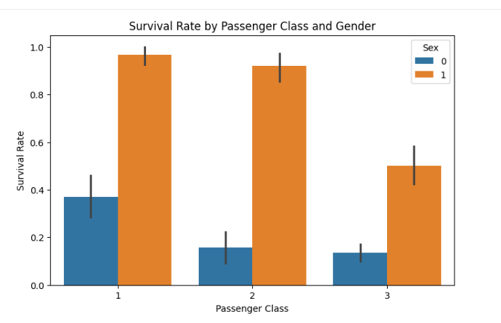

# Titanic Survival Analysis 🚢

This is a **Data Science project** analyzing the Titanic dataset. The project demonstrates **data cleaning, visualization, and predictive modeling** using Python.

---

## 📌 Project Overview

The Titanic dataset contains information about passengers on the Titanic, such as age, gender, class, and survival status. This project focuses on:

1. **Data Cleaning:** Handling missing values and encoding categorical variables.  
2. **Exploratory Data Analysis (EDA):** Visualizing survival rates by gender, passenger class, and their combination.  
3. **Predictive Modeling:** Using Logistic Regression to predict survival.  
4. **Evaluation:** Measuring model accuracy on a test set.

---

## 🧰 Skills & Tools

- **Python** – Pandas, NumPy  
- **Data Visualization** – Matplotlib, Seaborn  
- **Machine Learning** – Scikit-learn (Logistic Regression, train/test split)  
- **Data Cleaning** – Handling missing values, mapping categorical variables  

---

## 📊 Visualizations

- **Overall Survival Count:** Shows how many passengers survived vs. not survived.  
- **Survival by Gender:** Highlights that females had higher survival rates.  
- **Survival by Class & Gender:** Shows survival patterns across passenger classes and genders.

---

## 📝 How to Run

1. Download `train.csv` from Kaggle: [Titanic Dataset](https://www.kaggle.com/c/titanic/data)  
2. Place the CSV file in the same folder as the notebook.  
3. Open `Titanic_Survival_Analysis.ipynb` in **Colab** or **Jupyter Notebook**.  
4. Run all cells step by step.

---

## 🏆 Results

- Logistic Regression model achieved **~79% accuracy**.  
- Insights:  
  - Female passengers were more likely to survive.  
  - First-class passengers had higher survival chances.  
  - Age, fare, gender, and class are strong predictors of survival.

---

## 📁 Repository Contents

- `Titanic_Survival_Analysis.ipynb` – Complete notebook with code and visualizations  
- `datascience.png` – Cover image for the project (optional for visual appeal)  

---

## 🔗 References

- Kaggle Titanic Dataset: [https://www.kaggle.com/c/titanic/data](https://www.kaggle.com/c/titanic/data)  
- Python Libraries: Pandas, NumPy, Matplotlib, Seaborn, Scikit-learn

---

> Created by **Rahat e Batool**
